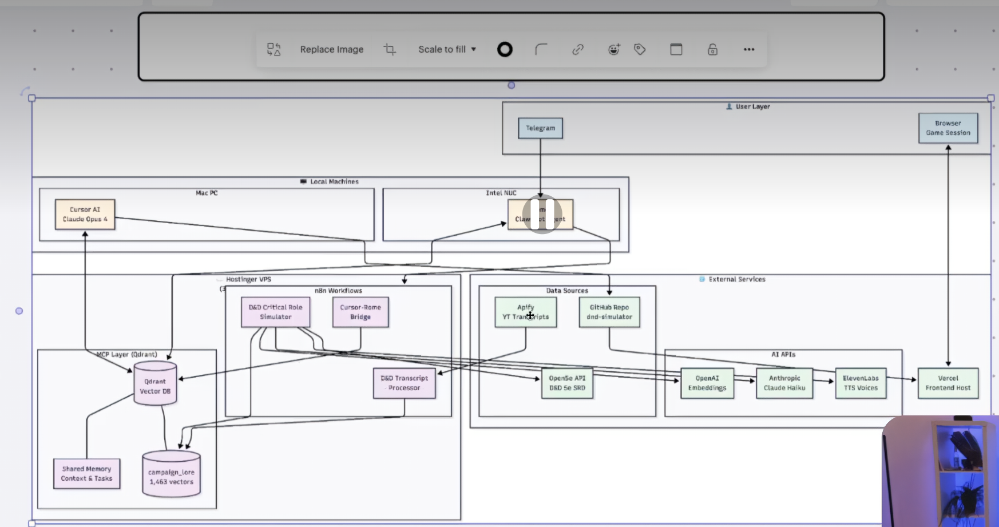

# 🎲 D&D AI Dungeon Master — Design Documentation

> **A voice-enabled AI Dungeon Master delivered as a Discord-native SaaS experience.**

Players speak naturally to an AI DM in Discord voice channels, see maps and combat in an embedded Activity UI, and manage campaigns with persistent memory — all without leaving Discord.



---

## 🏗️ Architecture at a Glance

| Layer | Component | Technology |
|-------|-----------|-----------|
| **User Interface** | Discord Bot (voice + commands) | Python / discord.py |
| **User Interface** | Discord Activity (game UI) | Next.js / TypeScript / React |
| **Backend** | API & Orchestration | Next.js API Routes (Vercel) |
| **AI Agent** | DM Brain | Abacus Claw (OpenClaw) |
| **Data** | Relational DB | Supabase (PostgreSQL) |
| **Data** | Vector Store | Qdrant |
| **Voice** | Speech-to-Text | ElevenLabs Scribe v2 / Cartesia Ink |
| **Voice** | Text-to-Speech | ElevenLabs |
| **External** | D&D Rules | Open5e API (D&D 5e SRD) |
| **Hosting** | Frontend | Vercel |
| **Hosting** | Bot + Qdrant + n8n | Hostinger VPS |

### How It Works

```
Player speaks in Discord → STT transcription → Abacus Claw (AI DM)
    → DM narrates response via TTS → Combat/map updates in Activity UI
```

---

## 📖 Documentation Index

### Architecture
| Document | Description |
|----------|-------------|
| [System Overview](docs/architecture/overview.md) | High-level architecture, design rationale, component map |
| [Discord Bot](docs/architecture/discord-bot.md) | Voice channel management, STT/TTS, slash commands |
| [Discord Activity](docs/architecture/discord-activity.md) | Embedded game UI, React components, real-time sync |
| [Backend API](docs/architecture/backend-api.md) | Orchestration layer, request flow, middleware |
| [Claw Integration](docs/architecture/claw-integration.md) | AI agent config, tools, RAG pipeline, prompt design |
| [Voice Pipeline](docs/architecture/voice-pipeline.md) | STT → Claw → TTS flow, latency budgets, cost per minute |

### API Specification
| Document | Description |
|----------|-------------|
| [API Endpoints](docs/api/endpoints.md) | RESTful endpoint specs with request/response examples |
| [API Schemas](docs/api/schemas.md) | TypeScript type definitions for all data structures |

### Data Models
| Document | Description |
|----------|-------------|
| [Database Schema](docs/data-models/schema.md) | Supabase/PostgreSQL tables, RLS policies, migrations |

### Infrastructure
| Document | Description |
|----------|-------------|
| [Deployment & Scaling](docs/infrastructure/deployment.md) | Hosting, Docker, CI/CD, monitoring, scaling plan |

### Cost Analysis
| Document | Description |
|----------|-------------|
| [Usage Metering & Pricing](docs/cost-analysis/usage-metering.md) | Unit economics, subscription tiers, cost optimization |

### Development
| Document | Description |
|----------|-------------|
| [Roadmap & Phases](docs/development/roadmap.md) | Phase 0-3 deliverables, success criteria, guidelines |

### Design System & UI/UX
| Document | Description |
|----------|-------------|
| [Design Docs Index](docs/design/README.md) | Overview of all design documentation |
| [Design System](docs/design/design-system.md) | Colors, typography, spacing, tokens, accessibility |
| [Component Library](docs/design/component-library.md) | Reusable React component specs |
| [Onboarding Flow](docs/design/user-flows/onboarding.md) | New user journey and tutorial |
| [Campaign Lifecycle](docs/design/user-flows/campaign-lifecycle.md) | Create, join, resume, archive campaigns |
| [Combat Flow](docs/design/user-flows/combat-flow.md) | Initiative, turns, actions, resolution |
| [Payment & Account](docs/design/user-flows/payment-account.md) | Subscriptions, billing, usage limits |
| [Game UI Overview](docs/design/wireframes/game-ui-overview.md) | Main game screen layout (map + sidebars) |
| [Lobby / Dashboard](docs/design/wireframes/lobby-dashboard.md) | Campaign selection and management |
| [Combat Screen](docs/design/wireframes/combat-screen.md) | Initiative tracker, HP, actions |
| [Character Sheet](docs/design/wireframes/character-sheet.md) | Stats, inventory, spells |
| [Settings](docs/design/wireframes/settings.md) | Audio, UI, notifications, accessibility |
| [Payment](docs/design/wireframes/payment.md) | Tier selection, checkout, billing |
| [Mobile / PiP](docs/design/wireframes/mobile-pip.md) | Responsive layouts and picture-in-picture |

---

## 🎯 Key Design Decisions

| Decision | Choice | Why |
|----------|--------|-----|
| **Platform** | Discord-first (not mobile app) | Zero install friction, voice-native, built-in social & payments |
| **AI Agent** | Abacus Claw | Managed agent with memory, tools, RAG — no LLM infra to operate |
| **UI Delivery** | Discord Activity (embedded iframe) | Rich game UI without leaving Discord |
| **Voice** | ElevenLabs (TTS) + Scribe v2 (STT) | Best quality, streaming support, character voices |
| **Database** | Supabase | Managed Postgres + Auth + Realtime subscriptions |
| **Component Reuse** | Port from `cr-campaign-simulator` | Existing React components (maps, combat, characters) |
| **Monetization** | Discord Premium Apps | Native billing, no Stripe integration needed |

---

## 🚀 Phased Rollout

| Phase | Name | Focus | Timeline |
|-------|------|-------|----------|
| **0** | MVP | Text-only Discord Bot + Supabase + Claw | 4-6 weeks |
| **1** | Voice Alpha | STT/TTS voice pipeline | 4-6 weeks |
| **2** | Activity Beta | Embedded game UI (maps, combat) | 6-8 weeks |
| **3** | Launch | Subscriptions, polish, public release | 4-6 weeks |

→ [Full Roadmap Details](docs/development/roadmap.md)

---

## 🛠️ Tech Stack

```
Frontend:     Next.js 14+ · React 18 · TypeScript · Tailwind CSS · Zustand
Backend:      Next.js API Routes · Vercel Serverless
Bot:          Python 3.11+ · discord.py · asyncio
AI:           Abacus Claw (OpenClaw) · Qdrant · OpenAI Embeddings
Voice:        ElevenLabs (TTS + Scribe v2 STT) · Cartesia Ink (alt STT)
Database:     Supabase (PostgreSQL + Auth + Realtime)
Data:         Open5e API (D&D 5e SRD)
Workflows:    n8n (existing CR Campaign Simulator workflows)
Hosting:      Vercel (frontend/API) · Hostinger VPS (bot/Qdrant/n8n)
```

---

## 📁 Repository Structure

```
dnd-ai-dm-design/
├── README.md                              ← You are here
├── docs/
│   ├── architecture/
│   │   ├── overview.md                    ← System architecture overview
│   │   ├── discord-bot.md                 ← Discord Bot deep-dive
│   │   ├── discord-activity.md            ← Discord Activity (UI) deep-dive
│   │   ├── backend-api.md                 ← Backend API orchestration
│   │   ├── claw-integration.md            ← Abacus Claw AI agent
│   │   └── voice-pipeline.md              ← STT → Claw → TTS pipeline
│   ├── api/
│   │   ├── endpoints.md                   ← RESTful API specification
│   │   └── schemas.md                     ← TypeScript type definitions
│   ├── data-models/
│   │   └── schema.md                      ← Supabase database schema
│   ├── infrastructure/
│   │   └── deployment.md                  ← Hosting, Docker, scaling
│   ├── cost-analysis/
│   │   └── usage-metering.md              ← Pricing, unit economics
│   ├── development/
│   │   └── roadmap.md                     ← Phase 0-3 roadmap
│   ├── design/
│   │   ├── README.md                      ← Design docs index
│   │   ├── design-system.md               ← Colors, typography, tokens
│   │   ├── component-library.md           ← React component specs
│   │   ├── user-flows/
│   │   │   ├── onboarding.md              ← New user journey
│   │   │   ├── campaign-lifecycle.md      ← Campaign management flow
│   │   │   ├── combat-flow.md             ← Combat turn flow
│   │   │   └── payment-account.md         ← Subscription & billing flow
│   │   └── wireframes/
│   │       ├── game-ui-overview.md        ← Main game screen layout
│   │       ├── lobby-dashboard.md         ← Campaign lobby & dashboard
│   │       ├── combat-screen.md           ← Combat interface
│   │       ├── character-sheet.md         ← Character stats & inventory
│   │       ├── settings.md                ← User preferences
│   │       ├── payment.md                 ← Subscription tiers & checkout
│   │       └── mobile-pip.md              ← Responsive & PiP layouts
│   └── images/
│       ├── overall-architecture.png       ← Architecture diagram
│       ├── architecture-detail-1.png      ← Detail view 1
│       └── architecture-detail-2.png      ← Detail view 2 (Lucidspark)
└── .gitignore
```

---

## 🤝 Contributing to This Documentation

This is a **living design document**. Update it when:

1. **Architectural decisions change** — Update the relevant doc in `docs/architecture/`
2. **API endpoints are added/modified** — Update `docs/api/endpoints.md` and `docs/api/schemas.md`
3. **Database schema changes** — Update `docs/data-models/schema.md`
4. **Cost estimates are revised** — Update `docs/cost-analysis/usage-metering.md`
5. **Roadmap milestones are completed** — Check off items in `docs/development/roadmap.md`
6. **New diagrams are created** — Add to `docs/images/` and reference in relevant docs

### Documentation Standards

- Use Markdown with consistent heading levels
- Include code examples for API endpoints and schemas
- Keep diagrams in `docs/images/` (PNG or SVG)
- Cross-link between documents using relative paths
- Date-stamp significant revisions in commit messages

---

## 📜 License

Private — All rights reserved.

---

*Last updated: May 2026*
