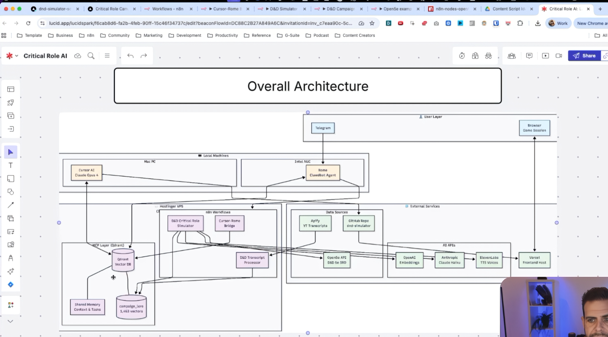

# System Architecture Overview

> **D&D AI Dungeon Master — Discord-First SaaS**

## Vision

A voice-enabled AI Dungeon Master delivered as a Discord-native experience. Players interact through Discord voice channels (speaking naturally to the AI DM) and an embedded Activity UI (maps, combat tracker, character sheets). The system leverages **Abacus Claw** as the AI agent brain, providing persistent campaign memory and tool-augmented game mastering.

## Architecture Diagram




## High-Level Components

| Component | Technology | Role |
|-----------|-----------|------|
| **Discord Bot** | Python / discord.py | Voice channel management, STT capture, TTS playback, slash commands |
| **Discord Activity** | Next.js (TypeScript) | Embedded iframe UI — maps, combat tracker, character sheets |
| **Backend API** | Next.js API Routes | Orchestration layer, Supabase CRUD, workflow triggers |
| **Agent Brain** | Abacus Claw (OpenClaw) | AI DM persona, campaign memory, tool calls, RAG |
| **Vector Store** | Qdrant | Campaign lore, session history, semantic search |
| **Database** | Supabase (PostgreSQL) | Users, campaigns, sessions, characters, messages, usage tracking |
| **Voice Pipeline** | ElevenLabs / Whisper / Cartesia | STT (Scribe v2 / Cartesia Ink) → Claw → TTS (ElevenLabs) |
| **Frontend Host** | Vercel | Hosts the Discord Activity (Next.js) |

## Discord-First Design Rationale

Instead of building a standalone mobile/web app, the product is delivered entirely through Discord:

1. **Zero onboarding friction** — Players are already in Discord; no separate app install.
2. **Voice-native** — Discord voice channels provide the real-time audio infrastructure.
3. **Social by default** — Party management, invites, and scheduling leverage existing Discord servers.
4. **Monetization built-in** — Discord Premium Apps handle subscriptions natively.
5. **Rich UI via Activities** — Embedded iframes provide full game UI without leaving Discord.

## Service Interaction Flow

```
Player speaks in Discord Voice Channel
        │
        ▼
┌─────────────────┐
│  Discord Bot     │ ← STT (ElevenLabs Scribe v2 / Cartesia Ink)
│  (Python)        │
└────────┬────────┘
         │ Transcribed text + context
         ▼
┌─────────────────┐
│  Backend API     │ ← Orchestration layer
│  (Next.js)       │
└────────┬────────┘
         │ Agent request with tools
         ▼
┌─────────────────┐
│  Abacus Claw     │ ← AI DM Brain
│  (OpenClaw)      │──► Qdrant (campaign memory)
└────────┬────────┘──► Open5e API (D&D 5e SRD)
         │
         │ DM response + tool outputs
         ▼
┌─────────────────┐     ┌─────────────────┐
│  TTS Engine      │     │  Discord Activity│
│  (ElevenLabs)    │     │  (Next.js UI)    │
└────────┬────────┘     └────────┬────────┘
         │ Audio stream           │ UI updates
         ▼                        ▼
    Discord Voice            Embedded iframe
    Channel playback         (maps, combat, etc.)
```

## Key Design Decisions

| Decision | Choice | Rationale |
|----------|--------|-----------|
| Platform | Discord-first (not mobile app) | Zero friction, voice-native, built-in social |
| AI Agent | Abacus Claw | Managed agent with memory, tools, RAG |
| Bot Language | Python (discord.py) | Best Discord bot ecosystem, voice support |
| Activity Framework | Next.js | Reuse `cr-campaign-simulator` React components |
| Database | Supabase | Managed Postgres + Auth + Realtime |
| Vector DB | Qdrant | Campaign lore embeddings, semantic search |
| Voice STT | ElevenLabs Scribe v2 / Cartesia Ink | Low-latency, high-accuracy speech recognition |
| Voice TTS | ElevenLabs | Natural-sounding DM voice with character voices |
| Subscriptions | Discord Premium Apps | Native payment, no Stripe integration needed |

## Related Documentation

- [Discord Bot Architecture](./discord-bot.md)
- [Discord Activity Architecture](./discord-activity.md)
- [Backend API Architecture](./backend-api.md)
- [Abacus Claw Integration](./claw-integration.md)
- [Voice Pipeline](./voice-pipeline.md)
- [Data Models](../data-models/schema.md)
- [API Specification](../api/endpoints.md)
- [Development Roadmap](../development/roadmap.md)
